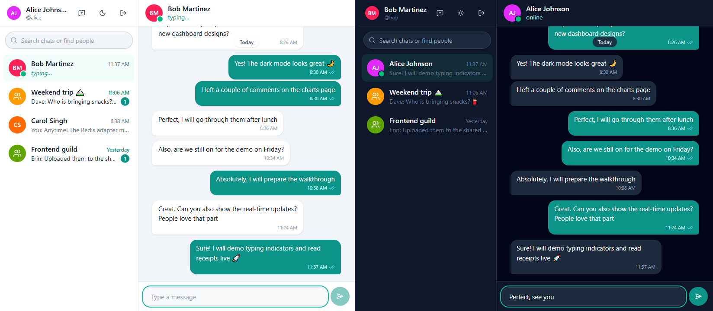
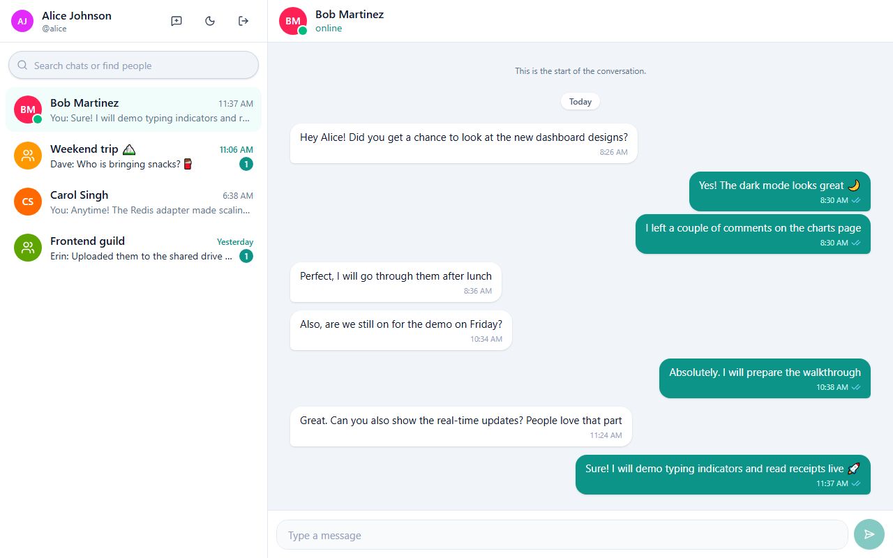
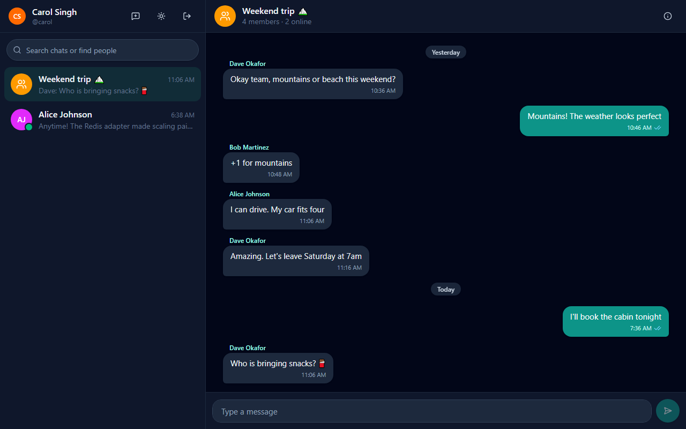
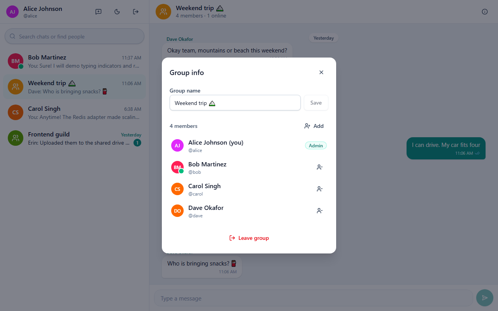
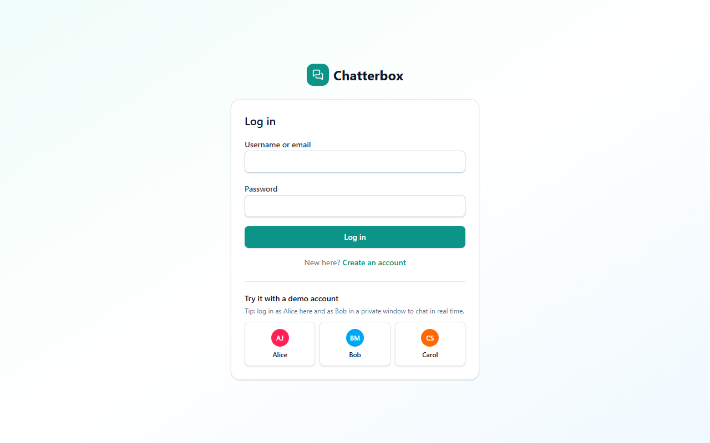
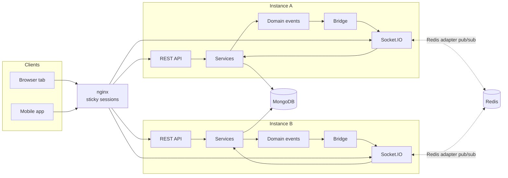

# Realtime Chat Server + Chatterbox web app

[](https://github.com/ebrahimmorkas/realtime-chat-server/actions/workflows/ci.yml)


A horizontally scalable chat backend in the style of WhatsApp Web or Slack DMs: direct and group
conversations, live delivery over WebSockets, typing indicators, online presence, read receipts
and unread counts.

It ships with **Chatterbox**, a React + TypeScript web app in [`client/`](client) that the server
hosts on the same origin. Open it in two browser windows and watch messages, typing indicators,
presence and read receipts update live.



## Highlights

- **REST + WebSocket in sync**: both paths go through the same service layer, and a typed
  domain-event bus fans every change out to the right Socket.IO rooms. A message sent over REST
  shows up live in every connected client.
- **Horizontal scaling**: with `REDIS_ENABLED=true`, the Socket.IO Redis adapter shares rooms and
  broadcasts across instances. CI proves it: a message sent to _instance A_ reaches a client on
  _instance B_.
- **Works without Redis**: presence, rate limits and broadcasting fall back to in-memory
  implementations for single-instance deployments.
- **Exactly-once sending**: clients attach a `clientId`, so retries after a reconnect are
  idempotent (unique partial index + race handling).
- **Race-safe DMs**: "find or create" is an atomic upsert on a unique pair key, so two users
  opening a chat at the same time can't create duplicates.
- **Presence that handles multiple tabs**: users go offline only when their _last_ socket
  disconnects, and `lastSeenAt` is recorded.
- **Efficient inbox**: unread counts for every conversation come from a single aggregation, and
  message history uses cursor pagination.
- **Abuse protection**: per-user WebSocket message limits, HTTP rate limits (stricter on auth),
  escaped regex search, Helmet with a strict CSP, and Zod validation on every input.

## Web client (Chatterbox)

| Inbox and conversation                         | Dark mode and group chat                      |
| ---------------------------------------------- | --------------------------------------------- |
|              |  |
| **Group management**                           | **Login with demo accounts**                  |
|  |           |

What it does:

- An inbox sorted by activity, with unread badges, last-message previews and live "typing…"
  previews. Search filters chats and finds people to message.
- Conversations with day dividers, grouped bubbles, sender names in groups, edited/deleted
  markers, and read receipts (✓ sent, ✓✓ seen, "Seen by …" in groups).
- Presence: online dots, "online" / "last seen 5 minutes ago", and how many group members are
  online.
- Edit and delete your own messages. Create groups, rename them, add or remove members, leave.
- Responsive: two panes on desktop, one at a time on phones. Light and dark themes.
- One-click demo users (Alice, Bob, Carol) with seeded conversations.

How it is built:

- **React 19 + TypeScript + Vite**, React Router, Tailwind CSS v4.
- **TanStack Query is the single source of truth.** Socket events (`message:new`,
  `conversation:read`, `typing`, …) are folded into the query cache by **pure, unit-tested
  reducer functions**, so REST data and live updates never disagree.
- **Optimistic sending with exactly-once delivery.** A message appears instantly as "sending",
  then is matched to the server copy by its `clientId`. That also merges the ack and the
  broadcast, which can arrive in either order. If the socket is down, it goes over REST. A
  failed message can be retried with the same `clientId`, so it is never stored twice.
- **Reconnect-safe.** A banner shows connection state, and after a reconnect the inbox and open
  histories are refetched to catch up on missed events.
- **Infinite history.** Older pages load as you scroll up (cursor pagination +
  `IntersectionObserver`) without the viewport jumping. A "New messages" pill appears when
  you're scrolled up.
- **Small live state** (presence, typing with auto-expiry, connection) lives in a tiny external
  store read through `useSyncExternalStore` selectors, so a typing event doesn't re-render the
  whole app.
- **Tests:** Vitest for the cache reducers and the composer's typing logic. **Playwright** runs
  two users in separate browser contexts against the real server and MongoDB in CI: live
  delivery, typing indicator, read receipts, unread badges, edit/delete, and group creation.

## Tech stack

Node.js 20+, TypeScript (strict, ESM), Express 5, Socket.IO 4, MongoDB + Mongoose, JWT, bcrypt,
Zod, pino, **optional** Redis (ioredis, `@socket.io/redis-adapter`, `rate-limit-redis`),
Vitest + Supertest + socket.io-client, Docker, nginx, GitHub Actions.

**Web client:** React 19, TypeScript, Vite, React Router, TanStack Query, Socket.IO client,
React Hook Form, Zod, Tailwind CSS, Playwright.

## Architecture



1. A client sends a message (`message:send` over the socket, or `POST /messages` over REST).
2. The **messages service** checks membership, persists the message, updates the conversation
   preview and publishes `message:created` on the in-process **domain event bus**.
3. The **bridge** emits `message:new` to the room `conversation:<id>`. With the Redis adapter,
   that broadcast reaches sockets connected to _any_ instance.

Every user socket also joins `user:<id>`. That is how new conversations, member removals and
presence updates are targeted. When someone is added to a group, their sockets join the room
immediately via `socketsJoin`, which also works across instances.

## Running with or without Redis

| Concern                      | `REDIS_ENABLED=false` (default)     | `REDIS_ENABLED=true`             |
| ---------------------------- | ----------------------------------- | -------------------------------- |
| Socket.IO broadcasting       | In-memory adapter (single instance) | Redis adapter (multi-instance)   |
| Presence                     | In-process map of sockets per user  | Redis set of socket ids per user |
| WebSocket message rate limit | In-memory fixed window              | Redis `INCR` + `PEXPIRE`         |
| HTTP rate limit              | In-memory                           | `rate-limit-redis` store         |

## Getting started

### Docker

```bash
docker compose up --build                                    # API + MongoDB
REDIS_ENABLED=true docker compose --profile redis up --build  # + Redis

# Two API instances behind nginx, sharing state through Redis:
docker compose -f docker-compose.yml -f docker-compose.scale.yml up --build
```

The image builds the React client and the server serves it, so open http://localhost:4000 in two
browser windows (use a private window for the second user). Run `npm run db:seed` against the
container's MongoDB (`MONGO_URL=mongodb://localhost:27017/chat`) to get the demo users.

### Local Node.js

Requirements: Node.js 20+, MongoDB 6+ (Redis optional).

```bash
git clone https://github.com/ebrahimmorkas/realtime-chat-server.git
cd realtime-chat-server
cp .env.example .env
npm install
npm run db:seed    # demo users alice, bob, carol, dave, erin (password: Password123!)
npm run dev        # API + WebSocket on http://localhost:4000

# Web client with hot reload (proxies /api and /socket.io to :4000)
cd client
npm install
npm run dev        # http://localhost:5175
```

For a production-style run, `npm run build` inside `client/` creates `client/dist`. The server
serves it automatically, with an SPA fallback and long-lived caching for fingerprinted assets.

## REST API

All endpoints are under `/api/v1`. Send `Authorization: Bearer <token>` except for register/login.

| Method | Endpoint                                     | Description                               |
| ------ | -------------------------------------------- | ----------------------------------------- |
| POST   | `/auth/register`                             | Create an account → `{ user, token }`     |
| POST   | `/auth/login`                                | Log in with username **or** email         |
| GET    | `/auth/me`                                   | Current user                              |
| GET    | `/users?search=`                             | Prefix search to start a chat             |
| GET    | `/users/:id`                                 | Public profile                            |
| GET    | `/conversations`                             | Inbox with last message and `unreadCount` |
| POST   | `/conversations/direct`                      | Find or create a DM `{ userId }`          |
| POST   | `/conversations/group`                       | Create a group `{ name, memberIds }`      |
| GET    | `/conversations/:id`                         | Conversation details (members only)       |
| PATCH  | `/conversations/:id`                         | Rename group (admin)                      |
| POST   | `/conversations/:id/members`                 | Add members (admin)                       |
| DELETE | `/conversations/:id/members/:userId`         | Remove member (admin) or leave (self)     |
| GET    | `/conversations/:id/messages?before=&limit=` | History, newest first, cursor-paginated   |
| POST   | `/conversations/:id/messages`                | Send `{ text, clientId? }`                |
| POST   | `/conversations/:id/read`                    | Mark conversation as read                 |
| PATCH  | `/messages/:id`                              | Edit own message                          |
| DELETE | `/messages/:id`                              | Soft-delete own message                   |
| GET    | `/health`                                    | Mongo/Redis status                        |

## WebSocket API

Connect with the JWT:

```js
const socket = io('http://localhost:4000', { auth: { token } });
socket.on('session:ready', ({ onlineContacts }) => {
  /* rooms joined, safe to go */
});
```

**Client → server** (every event with an ack callback receives `{ ok: true, data }` or
`{ ok: false, error: { code, message } }`):

| Event                          | Payload                               | Ack data                         |
| ------------------------------ | ------------------------------------- | -------------------------------- |
| `message:send`                 | `{ conversationId, text, clientId? }` | the saved message                |
| `conversation:read`            | `{ conversationId }`                  | `{ conversationId, lastReadAt }` |
| `typing:start` / `typing:stop` | `{ conversationId }`                  | —                                |
| `presence:query`               | `{ userIds: string[] }`               | `{ online: string[] }`           |

**Server → client:**

| Event                                       | Payload                                  |
| ------------------------------------------- | ---------------------------------------- |
| `session:ready`                             | `{ userId, onlineContacts }`             |
| `message:new` / `message:updated`           | message                                  |
| `message:deleted`                           | `{ conversationId, messageId }`          |
| `conversation:new` / `conversation:updated` | conversation                             |
| `conversation:member-removed`               | `{ conversationId, userId }`             |
| `conversation:read`                         | `{ conversationId, userId, lastReadAt }` |
| `typing`                                    | `{ conversationId, userId, isTyping }`   |
| `presence:update`                           | `{ userId, online, lastSeenAt? }`        |

Error codes include `VALIDATION_ERROR`, `NOT_FOUND`, `FORBIDDEN` and `RATE_LIMITED`.

## Configuration

| Variable                 | Default                  | Description                                          |
| ------------------------ | ------------------------ | ---------------------------------------------------- |
| `PORT`                   | `4000`                   | HTTP/WebSocket port                                  |
| `MONGO_URL`              | —                        | MongoDB connection string (**required**)             |
| `JWT_SECRET`             | —                        | ≥ 32 characters (**required**)                       |
| `JWT_TTL`                | `1d`                     | Token lifetime                                       |
| `REDIS_ENABLED`          | `false`                  | Enable Redis adapter, presence and rate-limit stores |
| `REDIS_URL`              | `redis://localhost:6379` | Redis connection                                     |
| `MESSAGE_RATE_LIMIT`     | `20`                     | Messages per user per window (WebSocket)             |
| `MESSAGE_RATE_WINDOW_MS` | `10000`                  | WebSocket rate-limit window                          |
| `RATE_LIMIT_MAX`         | `300`                    | HTTP requests per IP per window                      |
| `AUTH_RATE_LIMIT_MAX`    | `10`                     | Auth requests per IP per window                      |
| `RATE_LIMIT_WINDOW_MS`   | `60000`                  | HTTP rate-limit window                               |
| `CORS_ORIGIN`            | `*`                      | Allowed origins (comma-separated)                    |

## Testing

```bash
npm test            # needs MongoDB (TEST_MONGO_URL, default mongodb://localhost:27017/chat_test)
REDIS_ENABLED=true npm test   # also runs the two-instance scaling test
```

The suite covers REST flows and **end-to-end WebSocket behaviour** with real `socket.io-client`
connections: delivery, typing, multi-tab presence, room membership changes, read receipts, rate
limiting, and cross-instance delivery through Redis.

Web client:

```bash
cd client
npm test                              # Vitest: cache reducers, composer
npm run typecheck && npm run lint
npm run build && npm run test:e2e     # Playwright: two users against the real server
```

## Project structure

```
src/
├── app.ts / server.ts      # Express app, HTTP + Socket.IO bootstrap, graceful shutdown
├── lib/                    # db, redis, jwt, logger, errors, domain event bus
├── middleware/             # auth, validation, rate limiting, error handling
├── modules/
│   ├── auth/               # register, login, me
│   ├── users/              # user model + search
│   ├── conversations/      # DMs, groups, membership, inbox
│   └── messages/           # send, history, edit/delete, read receipts, unread counts
└── realtime/
    ├── socket-server.ts    # auth, handlers, presence, Redis adapter
    ├── bridge.ts           # domain events → Socket.IO rooms
    ├── presence.ts         # Redis / memory presence stores
    └── rate-limiter.ts     # Redis / memory event limiter
client/                     # Chatterbox React app (served from client/dist)
├── src/features/chat/      # socket provider, cache reducers, inbox, conversation view
├── src/features/auth/      # login, registration, session
└── e2e/                    # Playwright two-user tests
scripts/seed.ts             # demo users and conversations
deploy/nginx.conf           # sticky-session load balancer for the scaling demo
```

## Possible extensions

- File and image attachments via pre-signed S3 uploads
- Push notifications for offline users (queue worker)
- End-to-end encryption for direct messages
- Message reactions and threads

## License

[MIT](LICENSE)
